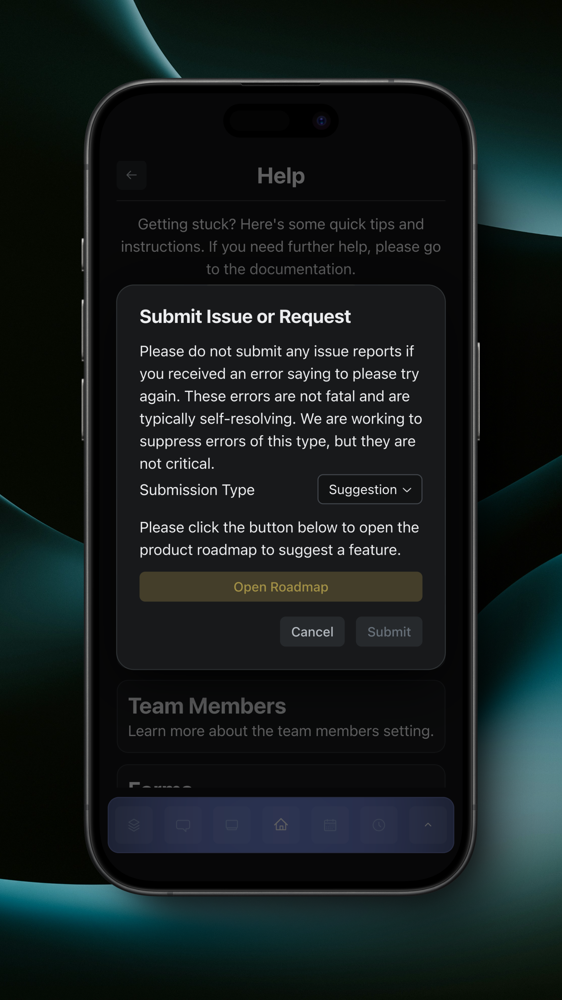
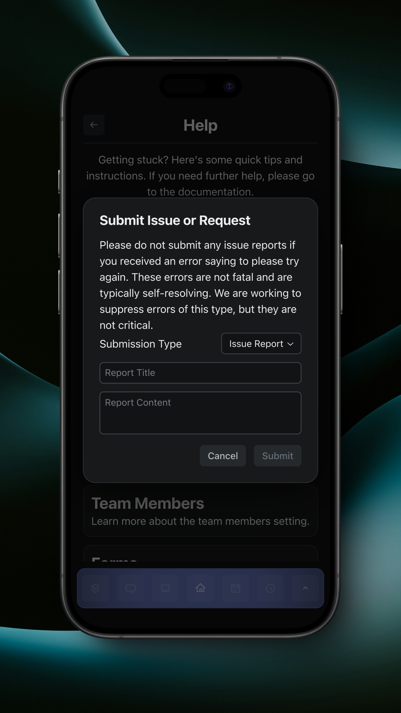

# Help

The Help page is a quick resource for getting answers to common questions, as well as quickly accessing the documentation, reporting an issue, or viewing the roadmap to submit a feature suggestion. The Help page can be accessed from the top right of the [Settings](broken-reference) page.

<figure><figcaption>
Help Page
</figcaption></figure>

If you have an issue, tap 'Submit Issue or Request'. A dialog will open, with a message about reporting issues as well as a dropdown for submission type. 'Suggestion' will be selected by default, and you are prompted to open the roadmap to suggest a feature.

<figure><figcaption>
Suggest Feature
</figcaption></figure>

If you change the submission type to 'Issue Report', you'll be prompted for a report title and content.&#x20;

<figure><figcaption>
Report Issue
</figcaption></figure>

The title and content, along with your user id and team number, will be sent to our developers who will review your issue, and if the issue is valid, both you and your team will be assigned 1 kudo. Read more about Kudos [here](kudos.md).
