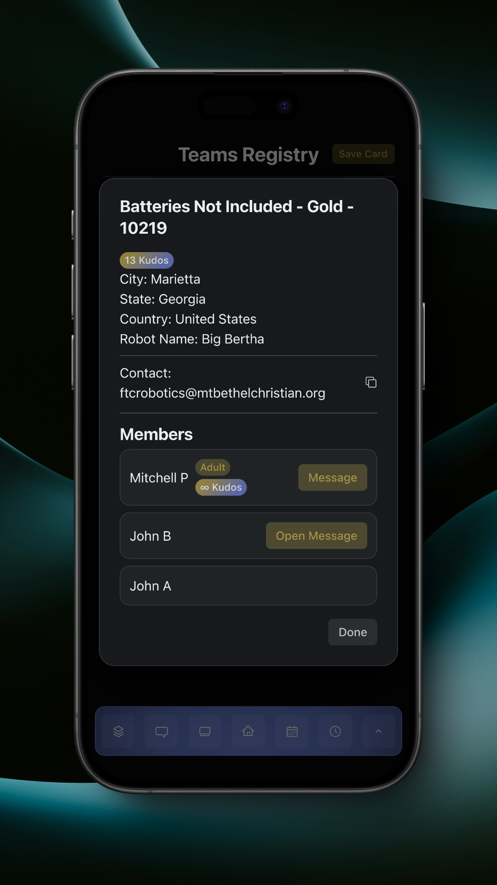

# Kudos

Kudos are how we show what users (and respective teams) helped improve the app through bug reporting. Kudos for teams can be viewed in the Teams Registry, and Kudos for members can be viewed in their team's profile in the Teams Registry. Kudos are assigned to users and their team when a valid issue is reported through the app.

<figure><figcaption>
Team 10219 Registry Profile, Showing Kudos
</figcaption></figure>
