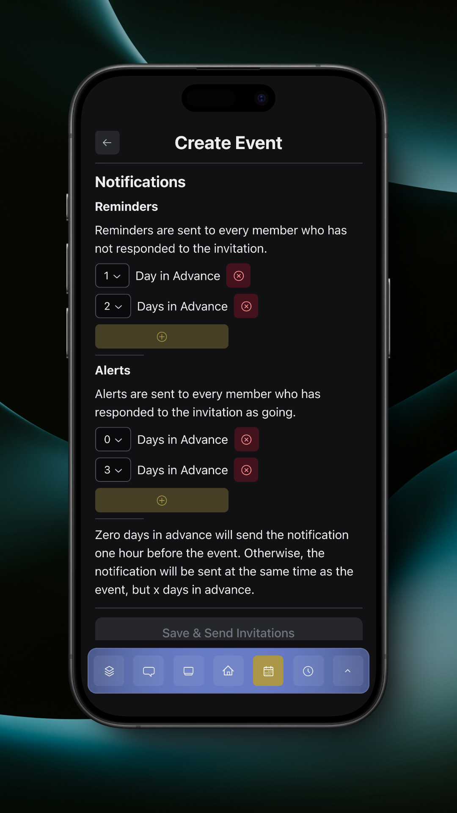

# Event Editor

To create an event, tap the plus button on the [Events](events.md) page.

<figure><figcaption>
Event Editor
</figcaption></figure>

In the event editor, you can configure the name, information, RSVP, start & end date & time, repetition, invited members, and notifications.

### Date & Time

#### Repetition

You can choose to repeat the event manually, daily, weekly, or monthly.

Repeating an event will link the repeated events together so edits to one can be applied to all. Read more [below](event-editor.md#saving-a-linked-event).

<figure><figcaption>
Manual Repetition
</figcaption></figure>

<figure><figcaption>
Daily Repetition
</figcaption></figure>

### Invited Members

Tapping on the pencil button next to invited members will allow you to configure the invited members. You can choose from the entire team, a group, or select members.

<figure><figcaption>
Invited Members
</figcaption></figure>

### Notifications

You can configure two types of notifications: alerts and reminders.

#### Alerts

Alerts are sent to every member who has responded as 'Going' to the event.

#### Reminders

Reminders are sent to every member who has not responded to the event.

<figure><figcaption>
Notifications
</figcaption></figure>

### Saving a Linked Event

If you edit and save an event that is linked to another event, you will have two options: apply changes to all events, or only save this event and remove it from the link.

Note that even if you apply changes to all events, the date and time will not be changed for any of the events except for the original event that you edited.

<figure><figcaption>
Save Linked Confirmation
</figcaption></figure>
