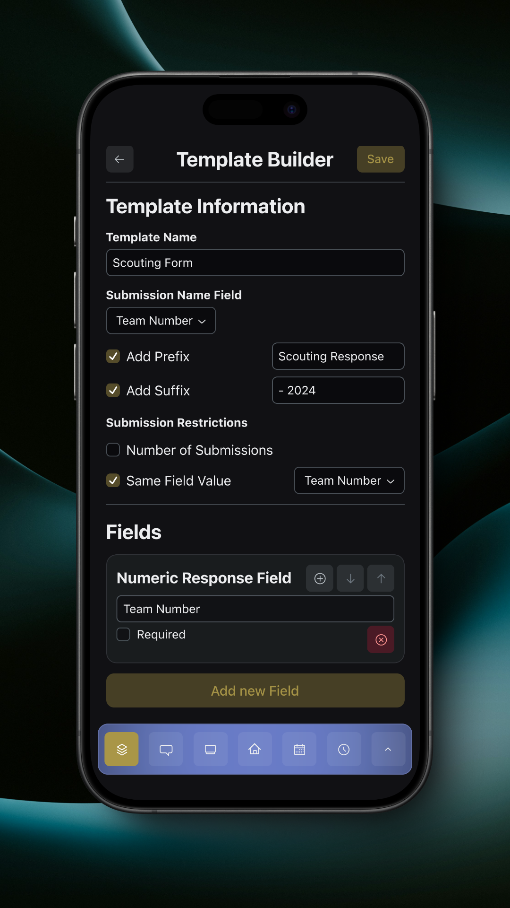
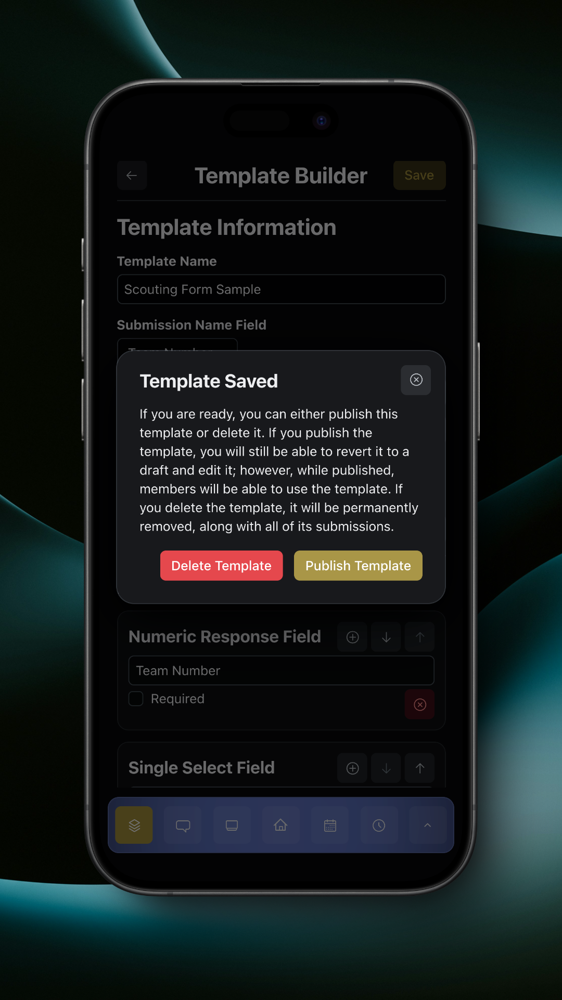

# Form Template Builder

The form template builder is where you build form templates.

<figure><figcaption>
Template Builder Page
</figcaption></figure>

There are four types of fields:

* Free Response Field
* Numeric Response Field
* Single Select Field
* Multiple Select Field

These fields can be added by tapping the 'Add new Field' button.

<figure><figcaption>
Numeric Field
</figcaption></figure>

Once you have at least one field configured, additional configuration settings for the template will appear at the top of the page. These settings are:

* Submission Name Field
  * Submission Name Prefix
  * Submission Name Suffix
* Submission Restrictions
  * Number of Submissions
  * Same Field Value

### Submission Name Field

The submission name field is the field's value that you want to be used as the submission's name. This can be any of the fields, but is typically used for a team number or team name.

#### Submission Name Prefix/Suffix

The submission name prefix and suffix configuration allows you to set a prefix and/or suffix for the submission name. This is typically used to identify the response type or year.

### Submission Restrictions

The submission restrictions allows you to configure restrictions for submissions for this template.


Submission restrictions only work for online devices. Offline devices will always be able to submit entries regardless of restrictions.


Number of submissions restricts the number of submissions that this form can receive before it is locked.

Same field value restricts responses to have a unique value in this field. No two responses can be submitted with the same value for this field.

***

You can move fields up and down using the respective arrow buttons, and you can add a field above another field by tapping the plus button and selecting a field type.

<figure><figcaption>
Numeric and Single Select Field
</figcaption></figure>

When you save a form template, a dialog will appear allowing you to either publish or delete the template.

<figure><figcaption>
Template Saved Dialog
</figcaption></figure>

Publishing a template will make it available to all team members.

Deleting a template will permanently delete the template, and, if the template has been previously published and responses were submitted for the template, all responses will be deleted as well.

To keep a template in your drafts, dismiss the dialog with the 'x' button in the top right of the dialog, and tap the back button in the top left of the page to return to the Forms page.
