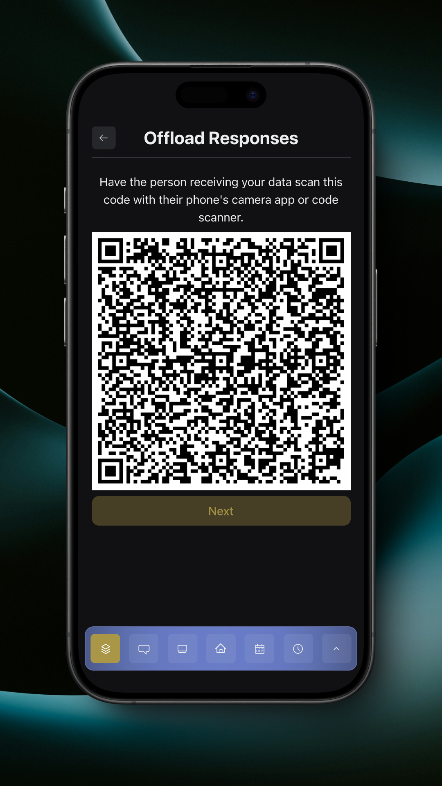

# Offline Submissions and Offloading

If you're offline or in [Event Mode](../../settings/app-settings.md#event-options), you can still submit form responses, but they won't be uploaded. Instead, they're stored on your device until you're ready to offload them to another device that is online.

When you're offline and have submissions stored on your device, the main Forms page will have a rocket button in the top left of the page.

<figure><figcaption>
Forms Page, Offline
</figcaption></figure>

When you tap the rocket button, it will take you to the Offload Responses page.

<figure><figcaption>
Offload Responses Page
</figcaption></figure>

Any online team members can scan this QR code to upload your response for you. Each response has its own QR code, which can be seen by tapping the 'Next' button. You will need to confirm that the current response has been uploaded before moving to the next response, as the current response will be removed from the device.

<figure><figcaption>
Next Response Confirmation
</figcaption></figure>

Read more about receiving offloaded responses [here](receiving-offloaded-responses.md).
