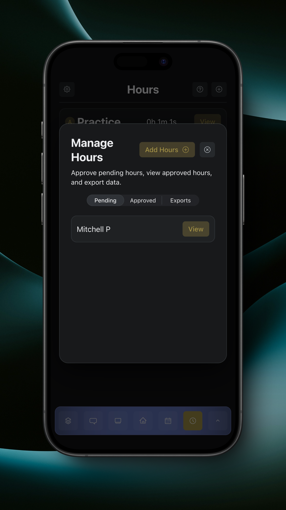
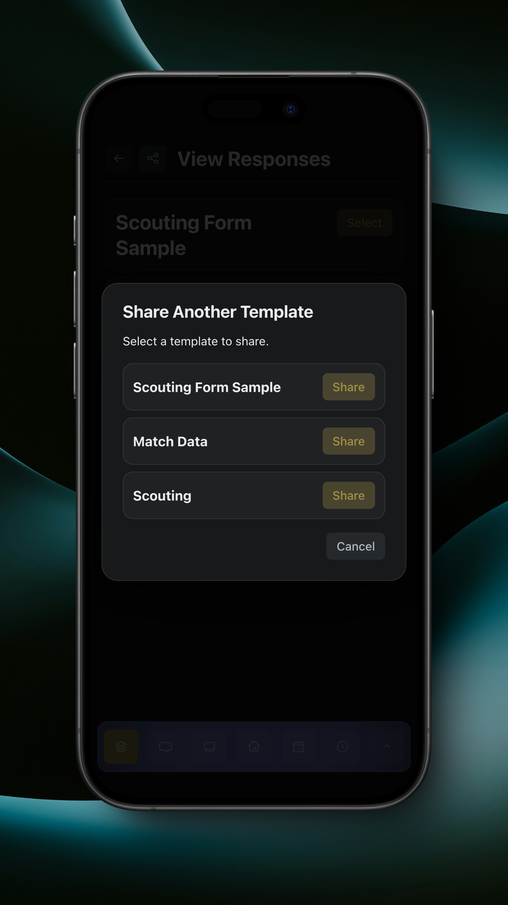
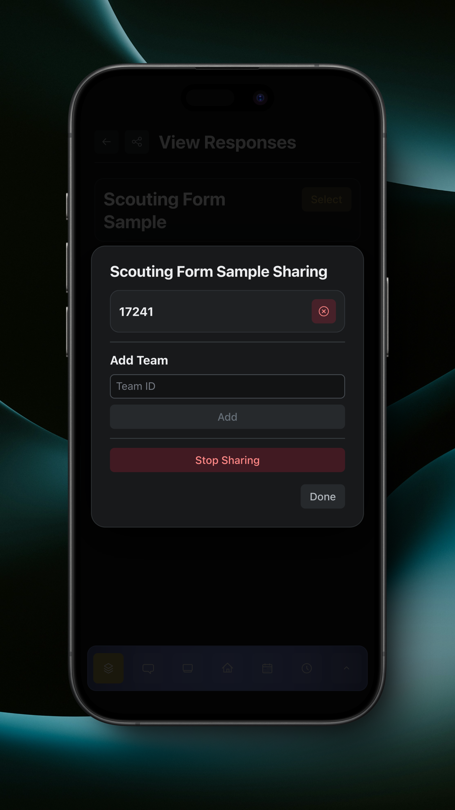

# Viewing Responses

As an adult, the View Responses page will look slightly different.

<figure><figcaption>
View Responses Page
</figcaption></figure>

Tapping the share button in the top left will open the Share Form Responses dialog.


Only teams that are in the teams registry can share responses.


<figure><figcaption>
Share Form Responses
</figcaption></figure>

Tapping the 'Share Another Template' button will allow you to share a template's responses that you aren't already sharing.

<figure><figcaption>
Share Another Template
</figcaption></figure>

Tapping the 'Share' button next to a template will allow you to share its responses with other teams in the teams registry.

To configure the teams that a template's responses are shared with, tap the 'View' button next to a template in the main sharing dialog.

<figure><figcaption></figcaption></figure>
