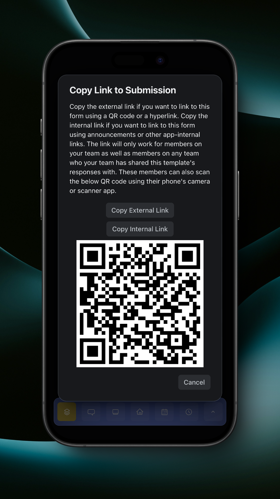

# Viewing Submissions

When you're online, the main Forms page will have a clock button in the top left of the page.

<figure><figcaption>
Forms Page
</figcaption></figure>

When you tap the clock button, it will take you to the view responses page.

<figure><figcaption>
View Responses Page
</figcaption></figure>

Your form templates will be listed. By tapping the 'Select' button on a template, the responses for that template will be displayed.

<figure><figcaption>
Form Responses
</figcaption></figure>

To filter the responses, use natural language to describe your filters in the text box, then tap 'Filter using MyTeam Intelligence' to apply your filters.

<figure><figcaption>
Natural Language Filtering
</figcaption></figure>

You can also apply filters by tapping the filter button in the top right.

<figure><figcaption>
Manual Filters
</figcaption></figure>

You can link to the filtered responses by tapping the link button in the top right.

<figure><figcaption>
Link to Filtered Responses
</figcaption></figure>

You can export submissions by tapping the export button in the top left.

<figure><figcaption>
Export Submissions
</figcaption></figure>

You can view a response by tapping on it.

<figure><figcaption>
View Response
</figcaption></figure>

You can link to the response by tapping the link button in the top right.

<figure><figcaption>
Link to Submission
</figcaption></figure>
