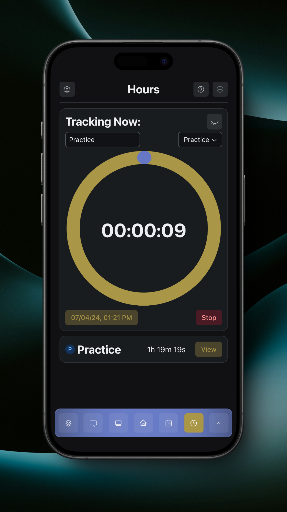
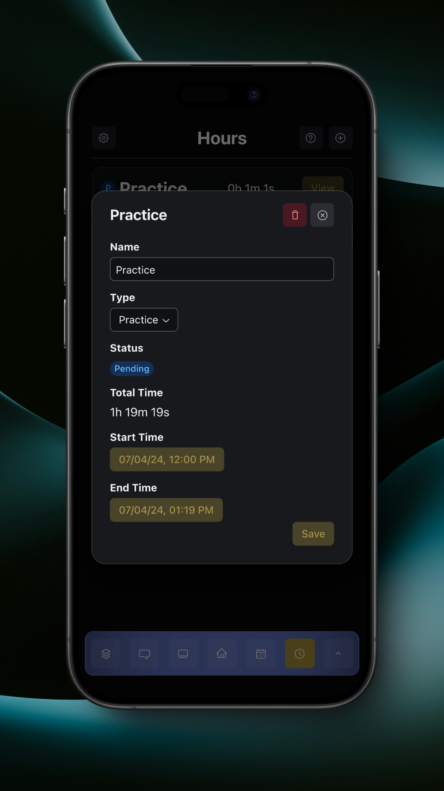
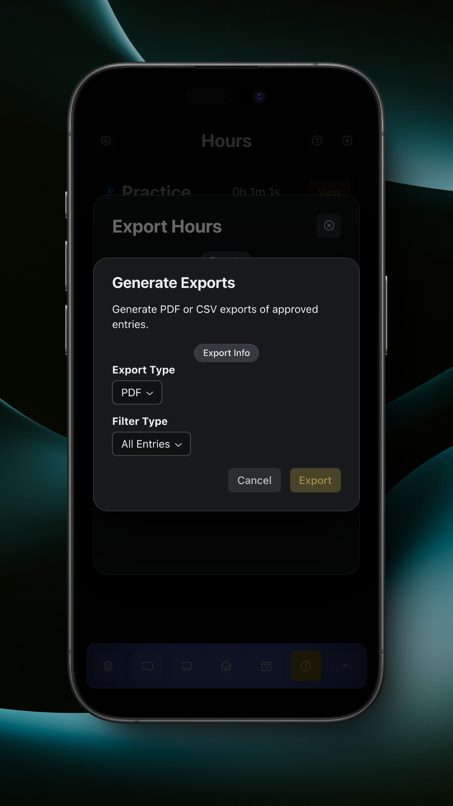

# Hours

Hours allows you to track time spent on any activity, like practice or service hours.

<figure><figcaption>
Hours Page
</figcaption></figure>

To start tracking a new time entry, tap the plus button in the top right.

<figure><figcaption>
Tracking Hours
</figcaption></figure>

If an entry is active, it can be minimized by tapping the eye button on the entry.

In an active entry, you can rename it, change its type, change its start time, and stop tracking.

To view the details of a past entry, tap the 'View' button on the entry.

<figure><figcaption>
Entry Details
</figcaption></figure>

In the entry details, you can rename it, change its type, change its start time, change its stop time, and delete it.

<figure><figcaption>
Delete Entry Confirmation
</figcaption></figure>

You can export your approved hours and view previous exports by tapping the export button in the top left.

<figure><figcaption>
Export Hours
</figcaption></figure>

To view the details of a previous export, tap the 'View' button on the export.

<figure><figcaption>
Expoort Detalis
</figcaption></figure>

You can then tap either 'Open' or 'Share' to open or share the export, respectively.

To generate a new export, tap the 'Generate Exports' button.

<figure><figcaption>
Generate Exports
</figcaption></figure>

After choosing the file type and entry type, tap the 'Export' button to export your approved entries. Sample PDF and CSV exports are below.




