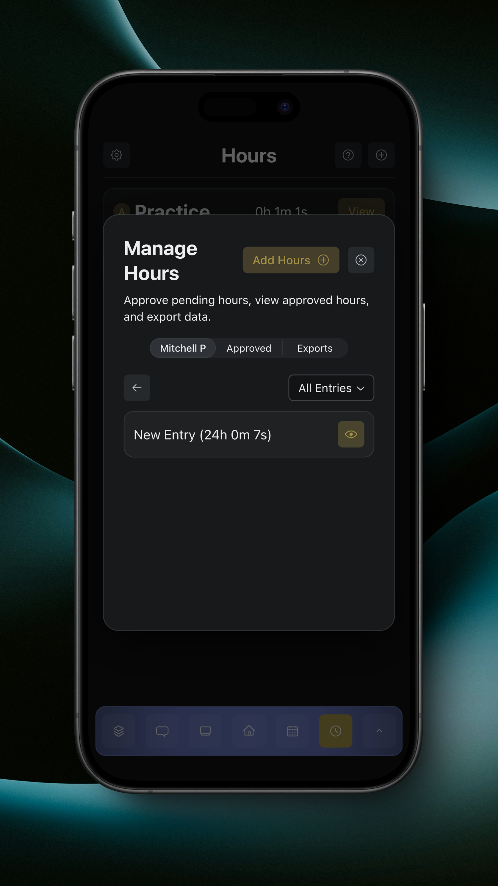
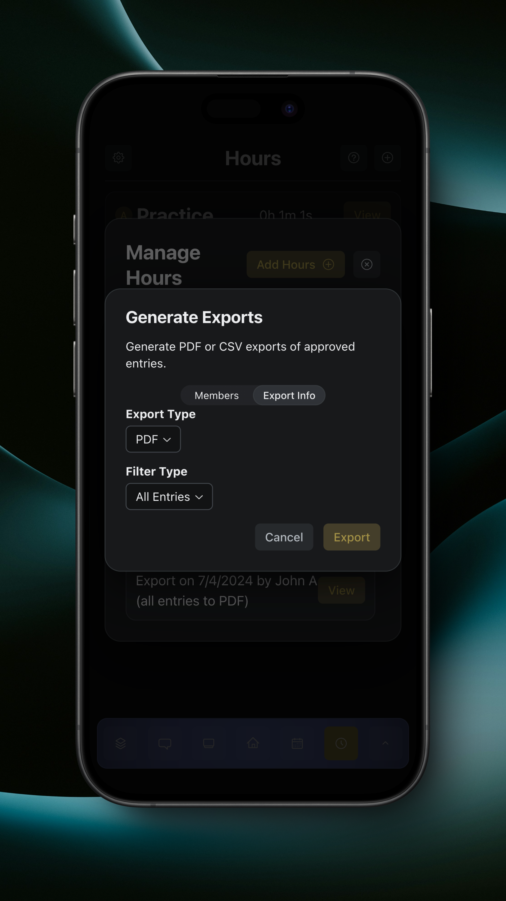

# Manage Hours

### Pending Entries

By tapping on the gear button on the Hours page, you can approve pending hours for your team's members and generate exports.

<figure><figcaption>
Manage Hours
</figcaption></figure>

Here, you can view and approve pending hours. Tapping 'View' on a user will show their pending entries.

<figure><figcaption>
Member Pending Entries
</figcaption></figure>

Tapping the eye button on an entry will show it in full detail, where you can also edit and approve the entry.

<figure><figcaption>
View Pending Entry
</figcaption></figure>

Tapping the pencil button for an entry allows you to edit the entry's information.

<figure><figcaption>
Edit Entry
</figcaption></figure>

Tapping the 'Approve' button on an entry will approve it.

### Approved Entries

Tapping the 'Approved' section shows approved hours for members.

<figure><figcaption>
Approved Entries
</figcaption></figure>

Similarly, tapping the 'View' button for a member shows their approved entries, and tapping the eye button shows an entry. Tapping the pencil button won't allow you to edit the entry since it's already been approved, but you can delete the entry from there.

### Add Hours

Tapping the 'Add Hours' button will allow you to add hours for members. After completing the information for the entry and selecting members, the entries will automatically be approved.

### Export Entries

Tapping the 'Exports' section shows exported hours entries.

<figure><figcaption>
Exports
</figcaption></figure>

Tapping the 'View' button next to an export shows the exported files for that export.

<figure><figcaption>
Exported Entries
</figcaption></figure>

Tapping the 'Open' or 'Share' buttons opens or shares the export, respectively.

Tapping the 'Generate Exports' button allows you to generate a new hours export.

<figure><figcaption>
Generate Exports
</figcaption></figure>

You can choose members from either an existing group or manual selection.

After tapping the 'Export Info' section, you can choose between a PDF or CSV file, and you can choose to export all entries, practice entries, event entries, or service entries.

<figure><figcaption>
Export Info
</figcaption></figure>
