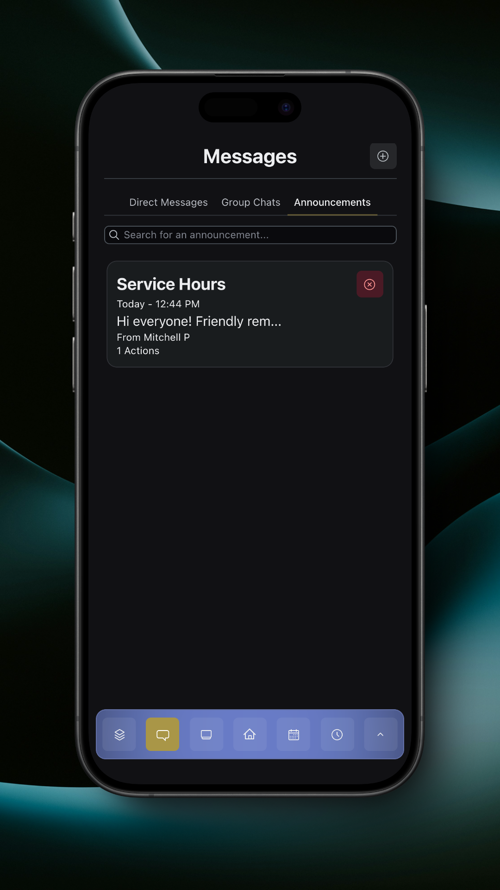

# Announcements

Announcements allow group managers to send important messages to members.

<figure><figcaption>
Announcements
</figcaption></figure>

You can view an announcement by tapping on it.

<figure><figcaption>
View Announcement
</figcaption></figure>

The announcement sender can configure buttons for the announcement. These buttons can link to either internal app features or external websites.

You can hide an announcement by tapping the red 'x' in either the announcement list or on the particular announcement.

If there are any hidden announcements, they can be reset to be shown by tapping the 'Reset Hidden Announcements' button in the overflow menu.

<figure><figcaption>
Overflow with Reset Hidden Announcements
</figcaption></figure>
