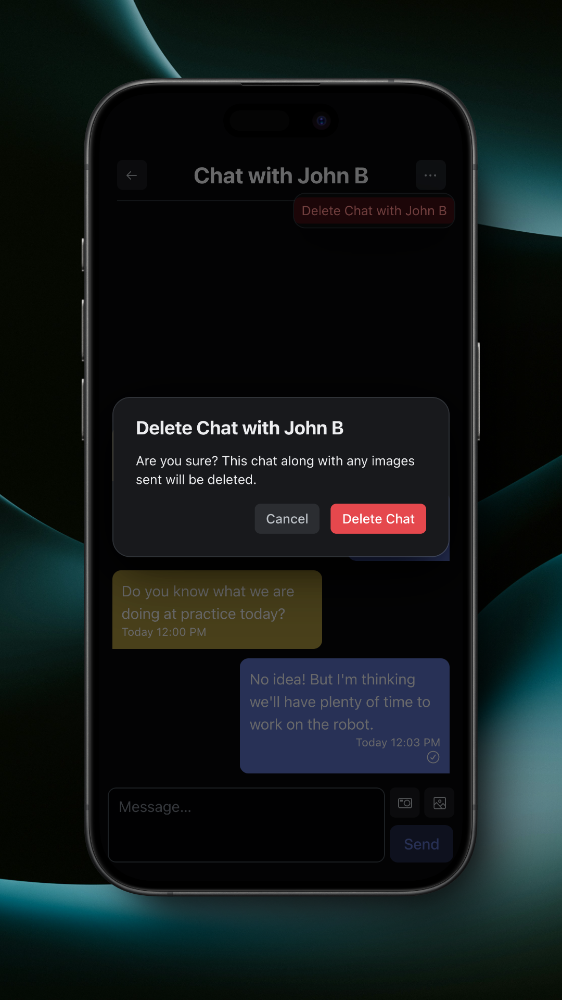

# Direct Messages

Direct Messages allow you to communicate with your team members, as well as members from other teams if your team is in the Teams Registry.

<figure><figcaption>
Direct Messages
</figcaption></figure>

Chats with members from another team will be marked with a red 'External' badge. You can start a new chat by tapping the overflow menu in the top right.&#x20;

<figure><figcaption>
Messages Overflow
</figcaption></figure>

Only members that you don't already have a chat with will appear in the list.

<figure><figcaption>
New Direct Message
</figcaption></figure>

You can open a chat by tapping on it.

<figure><figcaption>
Chat
</figcaption></figure>

When in a chat, you can send messages, take and send photos, and send photos from your photo library.

<figure><figcaption>
Send a Photo
</figcaption></figure>

For more information on images in messages, see [Group Chats](group-chats.md).

You can delete a chat by tapping the overflow menu in the top right.

<figure><figcaption>
Delete Chat
</figcaption></figure>
