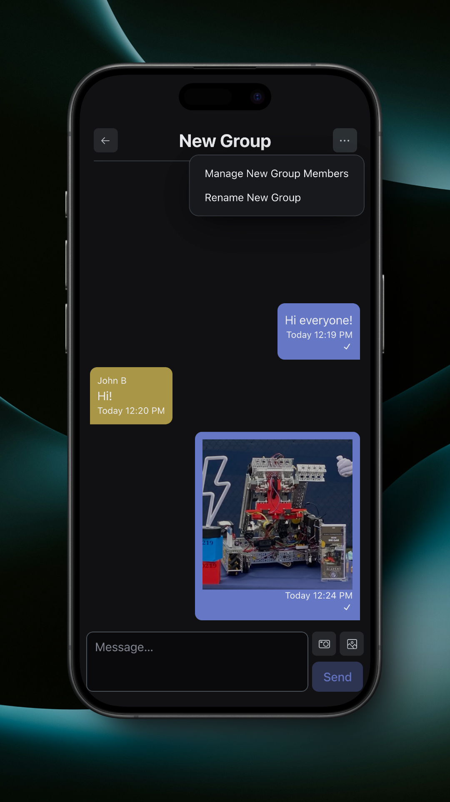

# Group Chats

Group Messages allow you to communicate with groups of your teams' members.

<figure><figcaption>
Group Chats
</figcaption></figure>

You can create a new group by tapping the overflow menu in the top right.

<figure><figcaption>
Messages Overflow
</figcaption></figure>

<figure><figcaption>
New Group
</figcaption></figure>

You can add members to the group as well as set a name for the group in the dialog that appears.


Normally, only managers can delete a group chat. However, if there aren't any managers in the group, any member can delete the group.



If a group is tied to an event, neither the members nor the name can be changed. However, if a group is tied to an event, any member can delete it.


<figure><figcaption>
New Group with Members
</figcaption></figure>

You can open a group by tapping on it.

<figure><figcaption>
Group Chat
</figcaption></figure>

### Sending Images

When in a group, you can send messages, take and send photos, and send photos from your photo library.

<figure><figcaption>
Send a Photo
</figcaption></figure>

Images will appear in their own bubble when sent.

<figure><figcaption>
Group Chat with Image
</figcaption></figure>

Tapping on an image will expand it. You can tap the download button to download it to your photo library.

<figure><figcaption>
Viewing an Image
</figcaption></figure>

### Group Management

Tapping on the overflow in the top right will allow you to add and remove members from the group as well as edit the group name.

<figure><figcaption>
Group Chat Overflow
</figcaption></figure>

<figure><figcaption>
Manage Group Members
</figcaption></figure>

<figure><figcaption>
Edit Group Name
</figcaption></figure>
