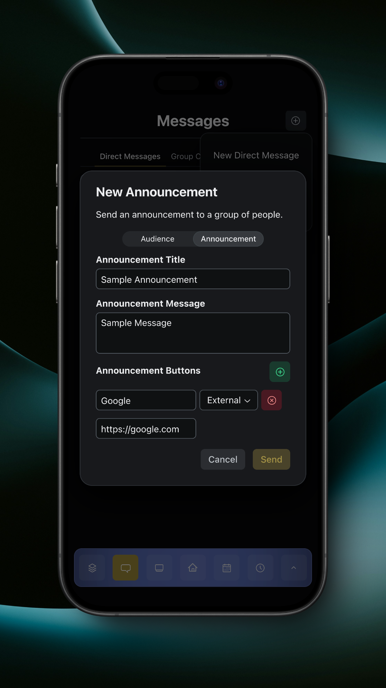
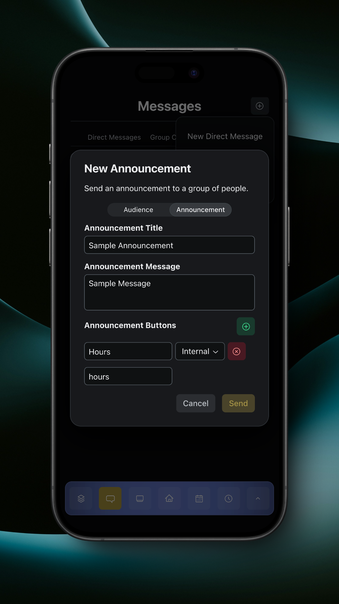

# Sending Announcements

To send an announcement, tap on the 'New Announcement' button in the Messages overflow menu. This will open a dialog.

<figure><figcaption>
New Announcement to Entire Team
</figcaption></figure>

You can select to send the announcement to the entire team, a certain group, or select members.

Under the 'Announcement' tab you can configure the title, message, and buttons.

External buttons can link to external resources like websites and hosted files.

<figure><figcaption>
External Button
</figcaption></figure>

Internal buttons can link to app features like hours, messages, and forms. Read more about In-App Linking [here](https://app.gitbook.com/s/kOKPUm6aPFJS12wANDbh/app-utilities/in-app-linking).

<figure><figcaption>
Internal Button
</figcaption></figure>

Announcements are sent to all selected members as Time Sensitive notifications if the member is on an iOS device.
