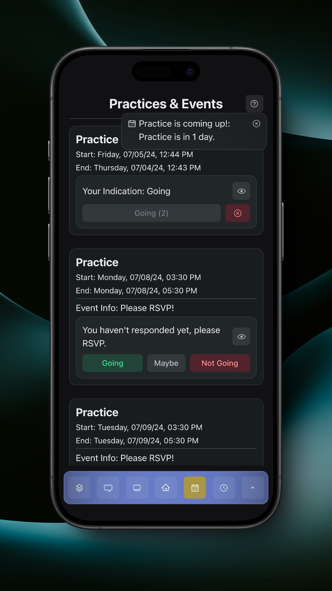

# Notifications

There are various types of notifications for events. These notifications depend on whether or not the event requires RSVP and whether or not you've responded to the event.

Notifications for events can be seen in either the app or in your device's notification area.

### Reminders

Reminders are sent to users who have been invited to an event, but haven't responded to the event yet.

#### Regular Events

<figure><figcaption>
Regular Event Reminder App Notification
</figcaption></figure>

<figure><figcaption>
Regular Event Reminder Device Notification
</figcaption></figure>

#### RSVP Events

<figure><figcaption>
RSVP Event Reminder App Notification
</figcaption></figure>

<figure><figcaption>
RSVP Event Reminder Device Notification
</figcaption></figure>

### Alerts

Alerts are sent to users who have responded 'Going' to an event.

<figure><figcaption>
Event Alert App Notification
</figcaption></figure>

<figure><figcaption>
Event Alert Device Notification
</figcaption></figure>
