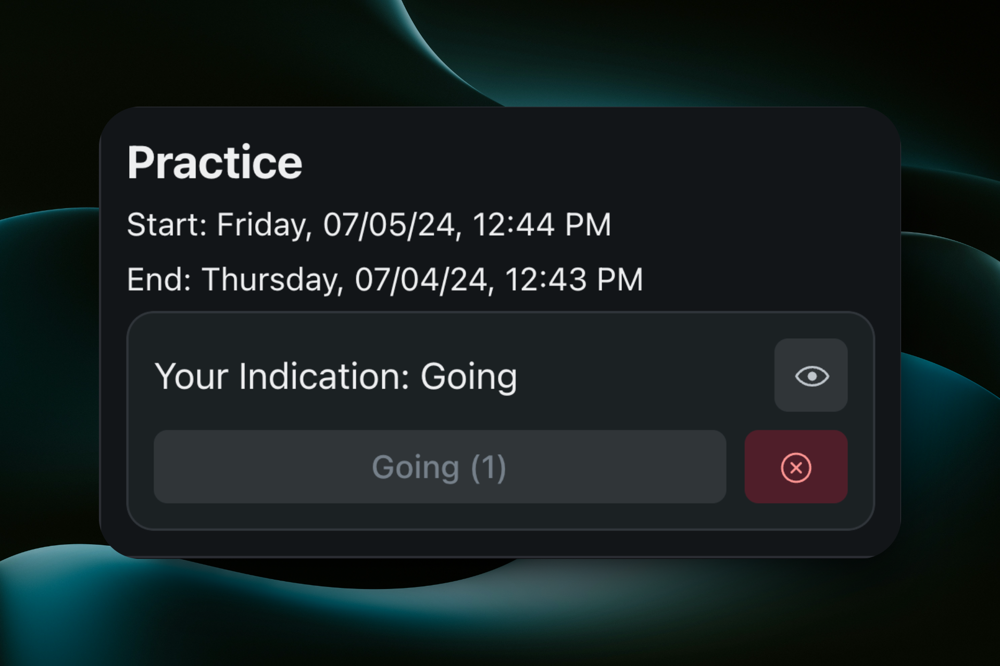
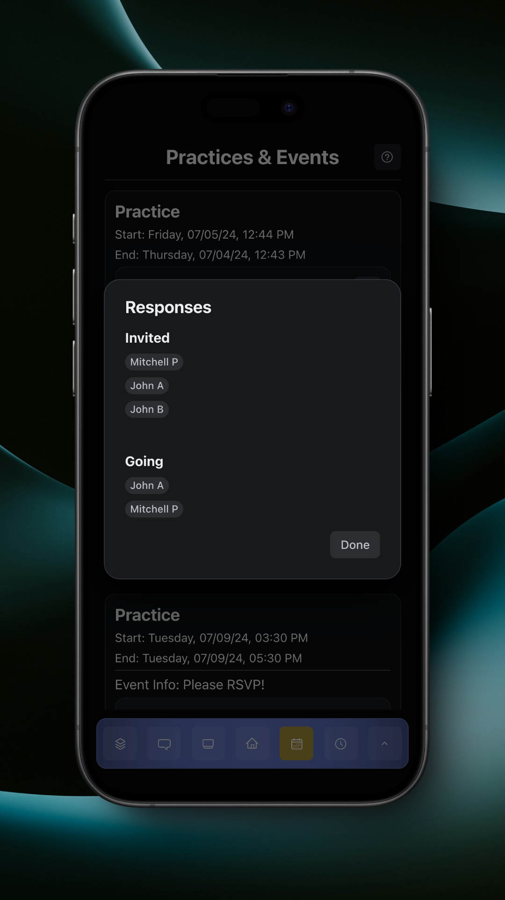

# Practices & Events

Practices & Events allow you to register for events for your team. This can be anything like practices, events, or service opportunities.

<figure><figcaption>
Practices &#x26; Events Page
</figcaption></figure>

You can respond to a regular event by tapping the 'Going' button, and if you change your mind, you can tap the red 'x' button to clear your response.

<figure><figcaption>
Regular Event with No Response
</figcaption></figure>

<figure><figcaption>
Regular Event with Response
</figcaption></figure>

You can respond to an event requiring RSVP by tapping either the 'Going', 'Maybe', or 'Not Going' button. If you change your mind, you can update your response accordingly.

<figure><figcaption>
Event Requiring RSVP with No Response
</figcaption></figure>

<figure><figcaption>
Event Requiring RSVP with Response
</figcaption></figure>

You can view the users invited to an regular event, as well as users who responded as' Going', by tapping the eye icon for the event.

<figure><figcaption>
Regular Event Responses
</figcaption></figure>

You can view the users invited to an event requiring RSVP, as well as users who responded as either 'Going' or 'Not Going', bu tapping the eye icon for the event.

<figure><figcaption>
Event Requiring RSVP Responses
</figcaption></figure>

Learn about event notifications [here](notifications.md).
