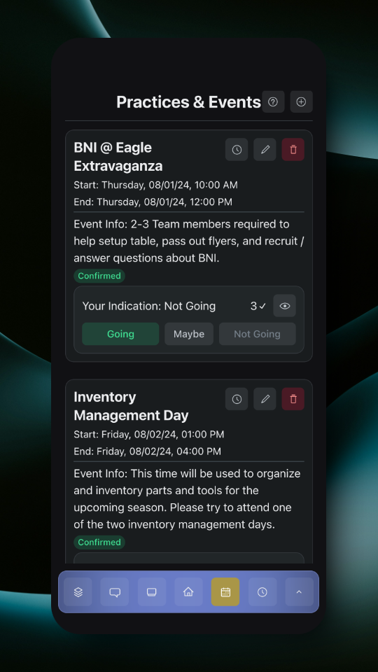

# Practices & Events

As an adult, the Practices & Events page will look slightly different.

<figure><figcaption>
Practices &#x26; Events Page
</figcaption></figure>

When tapping on the clock button on an event, that event's members who responded as going will automatically be opened in the Add Hours dialog, so that you can log those member's hours without having to manually select each member in the Add Hours dialog. The event name and start/end times are also carried over.

<figure><figcaption>
Add Hours Dialog
</figcaption></figure>
