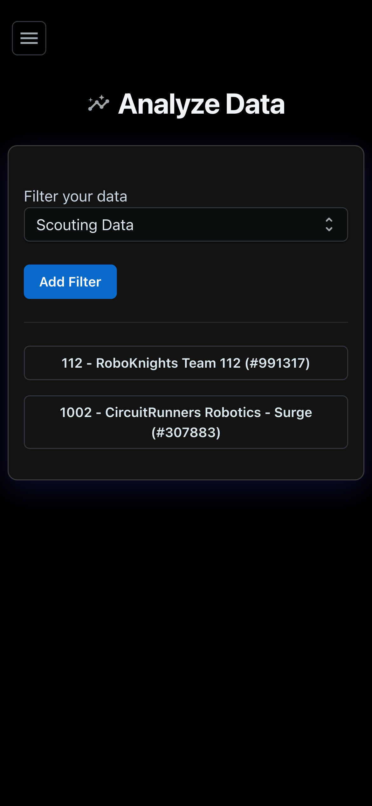
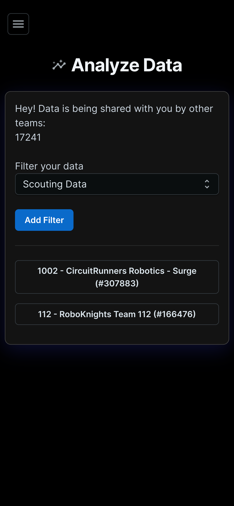
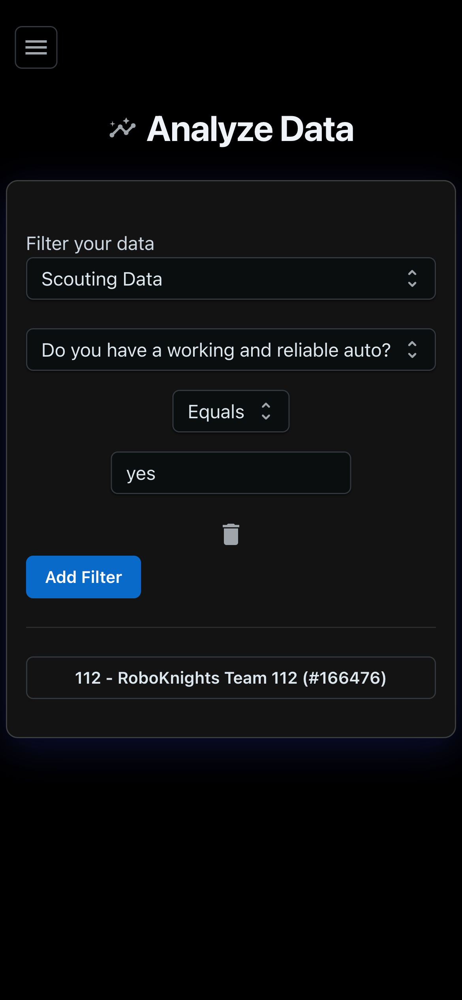
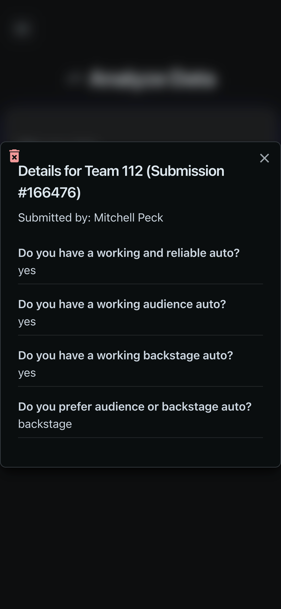

# Analyze Data

The analyze data page allows you to see your team's submissions, as well as those of any teams who are sharing their data with you. Sharing data with other teams is covered in the [Manager Docs](https://app.gitbook.com/o/L51rApvaZhl5QetYJ8rf/s/OOET5QiwzcXSGYSA6P9o/).

## Shared Responses

If a team is sharing their responses with you, you'll see a notification about it at the top of the Analyze page.

You can also see that a response was submitted by another team by clicking a response, and scrolling down to the 'Response team' field.

## Filters

You can use filters to filter the responses.

Select the question you'd like to filter, then the operation, then the value. You can add as many filters as you'd like by clicking the 'Add Filter' button, and remove filters by clicking on the trash can below the filter. Note that trash can icons are at the bottom of filters, so if you have multiple filters, make sure to click the trash can _below_ the filter that you'd like to delete.

Any responses that match your filters will be displayed below the filters box.

## Analyze Response

When you click on a response, a modal will appear with all the details from the response. At the top, you can see the team number as well as the submission key, followed by the name of the user that submitted the response. Questions and their responses are in the scroll list below, and at the bottom of the scroll list is the rest of the response data, such as key, owner team, type, event, scouted team, and submitter ID.

You can also delete the response by clicking the trash can in the top left corner. This action is irreversible, so make sure this is something you want to do.

