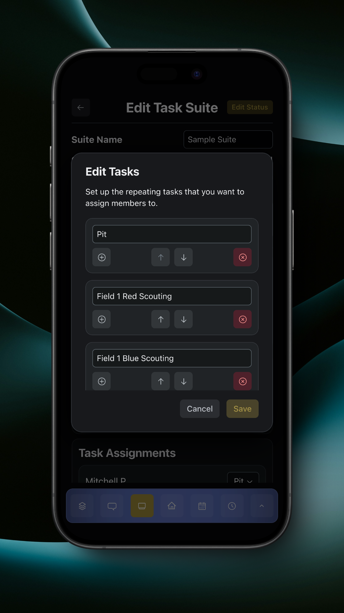
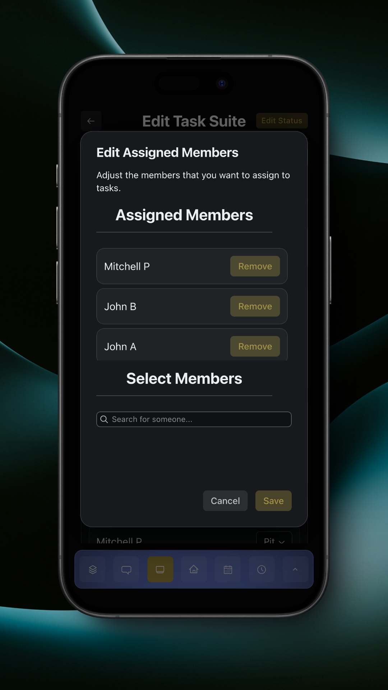

# Suite Builder


Currently, we only support cyclical suites.


Cyclical suites work cyclically. You configure a set list of cycling tasks, and assign members to start at different points in the list. You direct members to advance to the next task after a certain time period, like every two matches.

The suite builder allows you to configure suite information, tasks, members, and assignments.

<figure><figcaption>
Edit Suite
</figcaption></figure>

Tapping the pencil button next to Tasks opens the tasks editor.

<figure><figcaption>
Edit Tasks
</figcaption></figure>

The tasks editor allows you to add and remove tasks, and move tasks up and down the list. Tapping the plus button for a task will add a blank task above that task.

Tapping the pencil button next to Assigned Members opens the members editor.

<figure><figcaption>
Edit Assigned Members
</figcaption></figure>

The members editor allows you to add and remove members from the task suite.

The task assignments section allows you to assign members to start at different tasks in the list.

<figure><figcaption>
Task Assignments
</figcaption></figure>

All members will be assigned to the initial task by default.

When making changes to the task assignments, make sure to tap the 'Save' button that appears when you're done editing assignments.

Tapping 'Edit Status' will open a dialog that will allow you to update the status of the suite.

<figure><figcaption>
Edit Status
</figcaption></figure>

Publishing the suite will make it available to all members who are assigned to the suite.

Deleting the suite will permanently delete the suite. You can also archive the suite from the main Tasks page.
