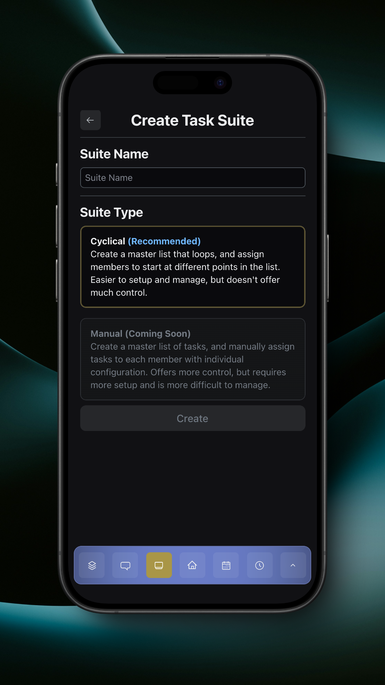

# Suite Creator

The suite creator is where you enter the suite name and choose the suite type. Currently, we only support cyclical suites, but are working on supporting manual suites.

<figure><figcaption>
Create Task Suite
</figcaption></figure>

Tapping 'Create' takes you to the suite builder. Learn more about the suite builder [here](suite-builder.md).

