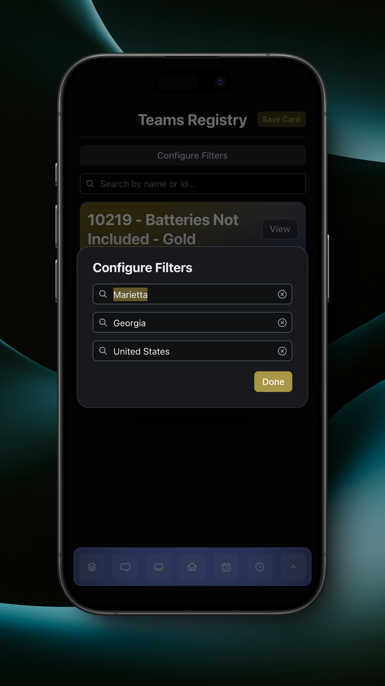
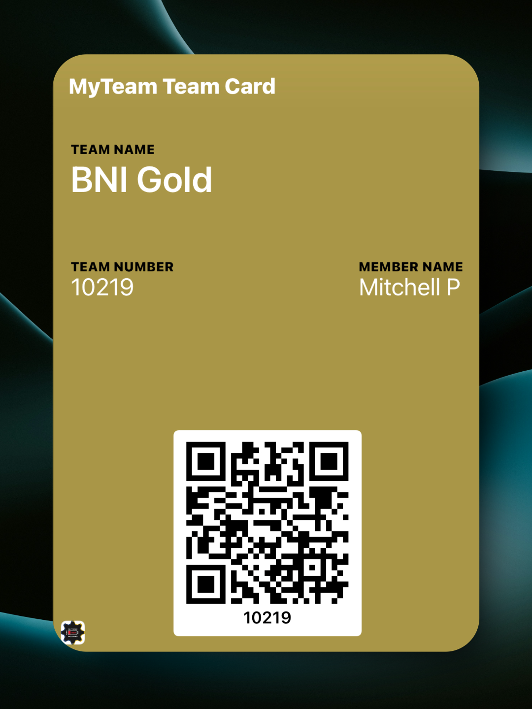

# Teams Registry

The Teams Registry allows your team to discover other teams on the MyTeam platform to create partnerships.


The Teams Registry will only be visible if your team is on the Teams Registry. Only adults can put your team on the Teams Registry.


<figure><figcaption>
Teams Registry Page
</figcaption></figure>

Your team will be displayed at the top of the list, with 10 more teams displayed below. Each team's information will be displayed, including City, State, Country, Robot Name, and Contact. If a field is blank, it won't be shown. Kudos are also displayed. Learn more about Kudos [here](../app-utilities/kudos.md).

By default, your team's city, state, and country are applied to the filters to show you teams near you.

<figure><figcaption>
Filters
</figcaption></figure>


At any given time, the Teams Registry will only display 10 teams, as well as your team. To view more teams, change your filters, or search for a team.


You can search for a team by either its ID or name. When searching for a team, filters are not applied.

Tap the 'View' button on a team to view its profile.

<figure><figcaption>
Team Profile
</figcaption></figure>

The team profile will show the team's information, including City, State, Country, Robot Name, and Contact. If a field is blank, it won't be shown. Kudos for the team and its members are also displayed. Learn more about Kudos [here](../app-utilities/kudos.md).

You can start a message with any of the members from that team by tapping the 'Message' button. You can also open an existing message with any of the members from that team by tapping 'Open Message'. These messages will be marked with a red 'External' badge in the messages list.

### Team Card

Your Team Card allows you to provide members from other teams with a way to quickly find your team on the Teams Registry.

<figure><figcaption>
Team Card
</figcaption></figure>

The card has a QR code which, when scanned, will take the user to the team's Teams Registry profile.

To add the card to your device's wallet, tap the 'Save Card' button on the Teams Registry page.

<figure><figcaption>
Save Team Card Dialog
</figcaption></figure>

This dialog will explain the Team Card, and when you tap 'Save to Device', the card will be saved to your device's wallet.
